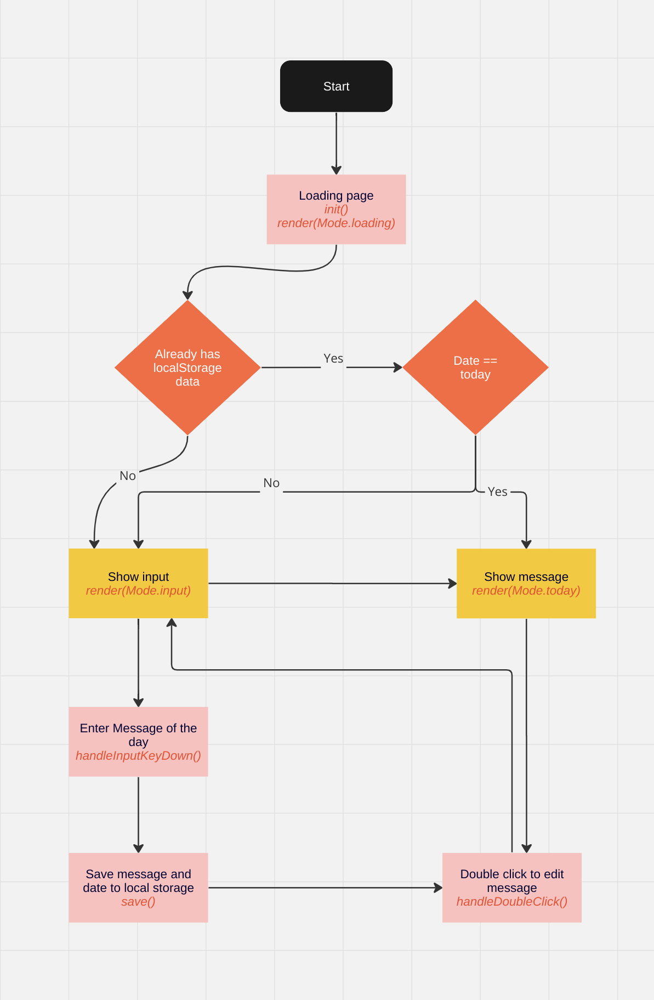

# Message of the day

## Installation

First install nodejs (minimun Node 18 LTS) and latest npm (see [here](https://nodejs.org/en/download/package-manager) for detailed install instruction.

Clone this project and run `npm install`

To start the development server run `npm run dev`

## Flowchart

